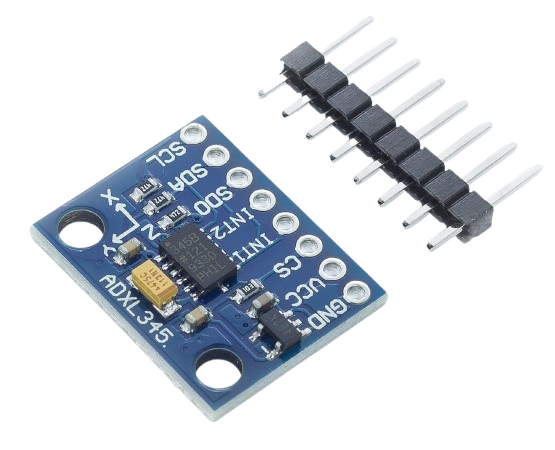
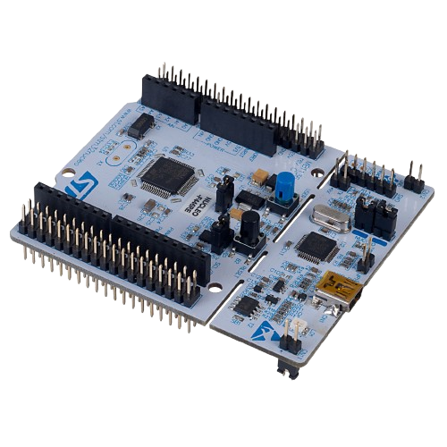

You can find the STM32 Nucleo code, which is ready to be integrated after configuration on STM32CubeIDE, in the GitHub repository: [ADXL345 Driver for STM32](https://github.com/WassimHedfi/adxl345-driver-stm32) 🚀.

This project utilizes the [STM32nucleoF446RE](https://www.st.com/en/microcontrollers-microprocessors/stm32f446re.html) development board 🛠️. The repository includes the UART driver for data transmission and the I2C driver for interfacing with the ADXL345 accelerometer 📡.

   
    

The `main.c` file provides a fully functional implementation of these drivers, ensuring reliable data transmission ✅.

Please note that we utilized Fast I2C mode for this project. Adding pull-up resistors to the I2C pins is recommended to enhance data integrity 🔧.
